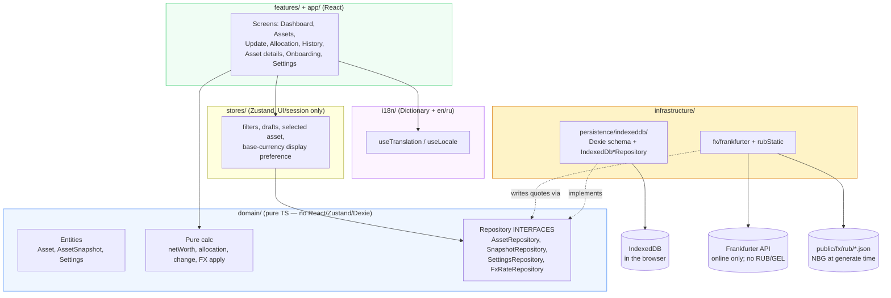
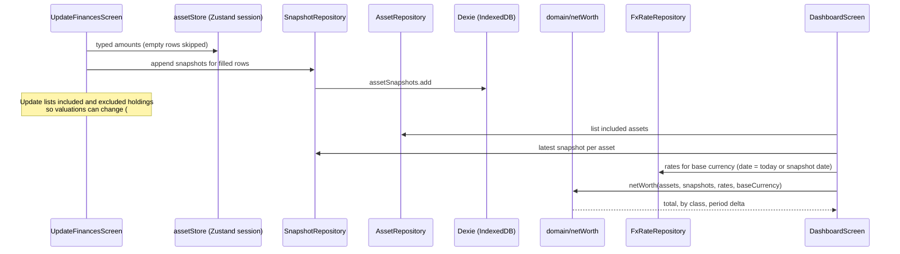

# My Money — Architecture

This document is updated after each issue is completed. It explains what every file does, why it exists, and how the pieces connect.

Product context lives in `PROJECT_BRIEF.md`; the visual language lives in `docs/DESIGN_SYSTEM.md`; the FX pipeline lives in `docs/FX.md`; the active work queue lives in `docs/issues-priority.md` (closed history: `docs/issues-priority-archive/`); the public-facing overview lives in `README.md`.

**Status (2026-08-30):** Epics 0–17 plus GitHub Pages landed. Deployed at `https://zhannam85.github.io/my-money/`. Native wrap is #162 (Capacitor Android + iOS); store listing is later children of #19.

---

## System Overview

My Money is a local-first personal balance sheet: the user manually records assets and liabilities, the app converts them into one base currency, and history is a first-class feature. Everything for the web/PWA/Android client runs in the browser — no backend, no accounts, no telemetry, no AI. User data lives in IndexedDB. The only expected **runtime** FX network call is Frankfurter. RUB history is generated at deploy time from NBG and loaded same-origin. Manual overrides live in IndexedDB. See `docs/FX.md`.

iOS is the **same Capacitor wrap** as Android (`ios/` next to `android/`), not a Swift rewrite. #20 (native Swift/SwiftUI) is won't-fix.

The web codebase follows Clean Architecture layering with feature-based folders, matching sibling projects (`turtle-steps-to-the-goal`, `life-kaleidoscope`):



**The one dependency rule that matters:** `domain/` imports nothing from React, Zustand, Dexie, or `fetch`. Features and stores talk to persistence and FX only through repository interfaces, so a future sync backend or a second FX provider means new implementations, not a rewrite of stores or screens. ESLint enforces the zones (#249): `domain/` cannot import React/Zustand/Dexie; production `features/` cannot import `infrastructure/persistence` (tests and `*TestSetup*` stay exempt). Backup/CSV I/O goes `features/export` action modules → `stores/backupBook` → IndexedDB.

**Liabilities are assets with a class.** The brief's "Assets vs Liabilities" split is a product concept, not two persistence trees. One `Asset` entity covers bank accounts, investments, cash, property, valuables, *and* loans. `assetClass: 'liabilities'` makes the amount subtract from net worth. Snapshots, FX, tracking status, archive, and export stay on one path. The UI still labels them as liabilities.

**Net worth is calculated, never stored** as a primary row. Historical net worth is recomputed from snapshots + the FX rate for each snapshot's date.

---

## Data Flow — updating balances, then reading net worth



Display unit / base currency is a **settings** concern. Stored snapshot amounts stay in the asset's own currency. Conversion happens at read time in `domain/netWorth` / `domain/fx`. Settings can also choose **Show all currencies**, which keeps native amounts (same as Original display mode) instead of converting into one total.

---

## Domain model

```ts
type AssetClass =
  | 'money'
  | 'investments'
  | 'property'
  | 'valuables'
  | 'liabilities';

type TrackingStatus = 'included' | 'excluded' | 'archived';

type ValuationMethod =
  | 'account_balance'
  | 'my_estimate'
  | 'appraisal'
  | 'market_price'
  | 'purchase_price';

type UpdateFrequency = 'weekly' | 'monthly' | 'yearly' | 'manual';

interface Settings {
  id: 'singleton';
  baseCurrency: string; // ISO 4217, e.g. 'EUR'
  locale: 'en' | 'ru';
  onboardingCompleted: boolean;
  updatedAt: string;
}

interface Asset {
  id: string;
  name: string;
  assetClass: AssetClass;
  type: string; // bank, cash, brokerage, apartment, mortgage, ...
  currency: string; // ISO 4217 — the asset's native currency
  institution?: string;
  trackingStatus: TrackingStatus;
  valuationMethod: ValuationMethod;
  purchaseValue?: number;
  updateFrequency: UpdateFrequency;
  createdAt: string;
  updatedAt: string;
}

interface AssetSnapshot {
  id: string;
  assetId: string;
  date: string; // ISO calendar date
  amount: number; // in the asset's native currency
  currency: string; // denormalized copy of asset.currency at write time
  createdAt: string;
}

interface FxRateQuote {
  date: string;
  base: string;
  quote: string;
  rate: number;
}
```

Repository interfaces (domain layer):

- `AssetRepository` — `getAll()`, `getById(id)`, `upsert(asset)`, `delete(id)` (delete is rare; archive is the default)
- `SnapshotRepository` — `getAll()`, `getByAsset(assetId)`, `getLatestByAsset(assetId)`, `getOnOrBefore(assetId, date)`, `append(snapshot)`
- `SettingsRepository` — `get()`, `save(settings)`
- `FxRateRepository` — `getRate(from, to, date)`, `getLatest(from, to)`, `put(quotes)` (cache)

Pure, unit-tested domain functions (no storage, no React, no network):

- `convertAmount(amount, from, to, rate)`
- `netWorth(assets, snapshots, rates, baseCurrency)` — included assets minus included liabilities
- `allocation(netWorthBreakdown)` — by class, by currency, by type
- `periodChange(history, from, to)` — absolute + percent
- `assetPerformance(snapshots, rates, baseCurrency)` — native vs base, optional FX vs value split
- `historicalNetWorth(assets, snapshots, rates, dates)` — uses **that date's** FX, not today's; if that day has no quote, carries forward the last earlier rate so the holding is not dropped. Each point includes the holding-by-holding breakdown for tooltips and History.

---

## Folder structure (feature-based, Clean Architecture)

```
src/
  app/                     # routing, app shell, providers
  data/                    # static copy: release notes, issue RCAs
  domain/
    asset/
    snapshot/
    settings/
    backup/                # versioned BackupBundle — no I/O
    fx/                    # convertAmount, rate lookup types — no fetch
    netWorth/              # totals, holdings, allocation, periodChange, history
  infrastructure/
    persistence/
      indexeddb/           # Dexie schema + repository IMPLEMENTATIONS
    fx/
      frankfurter/         # live Frankfurter; skips RUB/GEL
      rubStatic/           # same-origin CODE→RUB JSON (NBG at generate time)
      # no cbr/ or nbg/ clients — those APIs are generate-time only (docs/FX.md)
    debug/                 # tap / download debug text
  features/
    onboarding/
    charts/                # shared range chrome (#239)
    net-worth/             # shared series + change + missing rates (#246)
    dashboard/
    assets/                # list, create/edit, asset details (Flow 4)
    update-finances/
    allocation/
    history/
    settings/
    export/                # JSON backup + CSV via action modules
  shared/
    ui/                    # design-system primitives
    hooks/
    lib/
    native/                # Capacitor chrome, back button, share, widget
  stores/                  # Zustand, UI/session only; backupBook wraps IndexedDB book I/O
  i18n/
test/
```

Nothing outside `infrastructure/persistence/indexeddb/` imports Dexie. Feature screens and sections do not import IndexedDB; backup/CSV I/O goes through `features/export` action modules (`backupActions`, `csvActions`) which call `stores/backupBook`. Nothing outside `infrastructure/fx/` calls the network for rates. `fxStore` does not import features — Frankfurter online gating lives in `infrastructure/fx/shouldFetchFrankfurter`.

GitHub Pages is a project site at `/my-money/`. Production builds pass `--base=/my-money/` so Vite rewrites `index.html` asset URLs and React Router uses that `basename`. SPA deep links copy `index.html` to `404.html`.

The web app is installable as a PWA (`public/manifest.json`, Workbox service worker). Registration is skipped inside Capacitor so a later Android wrap is not double-caching the shell. IndexedDB remains the data store offline; FX fetch failures keep last cached quotes and surface a note instead of blocking the UI.

Copy goes through `src/i18n/` (English + Russian). Locale is `settings.locale` in IndexedDB so the backup field name stays `locale`. First visit follows `navigator.language`; More has an explicit switcher. Amounts use `en-US` / `ru-RU` number formatting.

---

## Routing (web)

| Path | Screen |
|---|---|
| `/` | Dashboard — today + positions (net worth, period change, chart) |
| `/assets` | Asset list + filters (All / Money / Investments / Property / Valuables / Liabilities) |
| `/assets/new` | Create asset |
| `/assets/:id` | Asset details |
| `/update` | Quick update flow |
| `/allocation` | Donut + legend (by class / currency / type) |
| `/history` | History — day list / calendar (+ shared range chrome) |
| `/settings` | More: Preferences, Data, About, collapsed Developer |
| `/onboarding` | First-run: base currency + first assets |

An empty book that has not skipped welcome is redirected to `/onboarding`. `/settings` stays reachable so Skip is available there too. Once any asset exists, or `settings.onboardingCompleted` is true, the gate does not run again. Dashboard already shows calculated net worth (identity FX for same-currency books); period change and the chart wait for later epics.

Bottom nav from the starting mock: Dashboard, Assets, center **+** (update), History, More. More is grouped as Preferences (currency, language, appearance; Android home-screen widget only in Capacitor), Data (JSON backup, CSV), About (privacy, release notes), and a collapsed Developer section (FX debug, RCA). `#fx-debug` and `#root-causes` open Developer. Allocation stays its own route (`/allocation`), linked from More and Dashboard — not a sixth tab. Store listing stays parked.

---

## State management

Zustand owns UI/session state only (update-flow drafts, list filters, selected range). It never owns persisted domain data as the source of truth — stores read/write through repository interfaces.

`AppShell` hydrates the book once on mount (`assetStore.load` via `SnapshotRepository.getAll()`) and again when the document is visible. Screens read the store. Writes still reload through the generation guard so a stale in-flight read cannot overwrite a newer book (#225, #237).

**No change** on the quick-update screen writes a same-amount snapshot for today. That keeps historical net worth and “last updated” on one path. There is no separate `lastConfirmedAt` field.

Base currency is stored in `Settings`. Changing it re-reads FX and re-renders; it does not rewrite historical snapshot amounts.

---

## FX

Canonical detail: [`docs/FX.md`](./FX.md). `fxStore` is the only runtime orchestrator.

- **Frankfurter** ([api.frankfurter.dev](https://api.frankfurter.dev/) v2, no API key) while online. Skips `RUB` and `GEL`. Client: `infrastructure/fx/frankfurter/`. Offline gate: `shouldFetchFrankfurter`.
- **Static RUB** — same-origin `{BASE_URL}fx/rub/{CODE}.json`, generated at deploy from NBG (`npm run generate:rub-rates`). Client: `infrastructure/fx/rubStatic/`. Not a live NBG/CBR call.
- **Manual overrides** — Settings → IndexedDB; `mergeRateTables` prefers them over system quotes for the same pair + date.
- Cache system quotes in IndexedDB via `FxRateRepository` so charts work offline after a fetch or static load.
- Converted values are estimates / reference rates, labeled as such — not executable quotes.
- Same-currency pairs are rate `1` with no network.
- Historical net worth **must** use the rate for that history date (weekend/holiday/missing-dataset dates reuse the previous quote via `lookupRateOnOrBefore`). A missing same-day quote must not drop the holding.
- Only currency codes and dates are sent. User balances, names, and assets never leave the device.
- Do **not** add `src/infrastructure/fx/cbr` or `nbg`, and do not add a third live fetch.

---

## Platforms

| Surface | Stack | Persistence |
|---|---|---|
| Web / PWA | This React app | IndexedDB (Dexie) |
| Android | Capacitor wrapping this app | Same IndexedDB (WebView) |
| iOS | Capacitor wrapping this app | Same IndexedDB (WebView) |

Do not architect `domain/` against Capacitor. Shared meaning (entities, calculations, export JSON) still matters. Native builds use Vite’s default `/` base (`npm run cap:sync`); GitHub Pages keeps `--base=/my-money/`. iOS Xcode/TestFlight still need a Mac (`docs/native-app-device-testing.md`).

Capacitor follow-ups (icons, chrome, back button, backup share, stores) are children of #19.

---

## Design system

Calm, numbers-first, light theme with a green accent in the starting mock. Tailwind + shadcn/ui. Shared primitives before feature screens: `Button`, `Chip`, `Input`, `Select` / `SelectField`, `Card`, `NumberInput`, `MoneyInput`, `TextField`, `DateField`, `StatCard`, `EmptyState`, `PageHeader`, `BottomNav`, `SortableRow`, `ConfirmDialog`. Control height lives in `--control-height` / `--control-height-compact` (#232); amount fields use `MoneyInput` (#236); pages must not invent `h-12` / pill padding. Destructive confirms use `useConfirm` instead of `window.confirm` (#247).

No gamification. Estimated valuations must look distinct from account balances. Liability amounts display as negative in summaries.

Accessibility as we build: semantic HTML, visible focus, ARIA on icon-only controls, WCAG AA contrast, keyboard nav. Sweep (#18): skip-to-content, `aria-pressed` on chips, allocation colors darkened for contrast, main column `min-w-0` so tables/chips scroll on small screens.

---

## Scaffold (Epic 0 / #1)

| File | Purpose |
|------|---------|
| `package.json` | React 19, Vite 8, Tailwind 4, Vitest, ESLint, Prettier, shadcn CLI |
| `vite.config.ts` | React + Tailwind + `vite-plugin-pwa` (web only; skipped in Vitest). `@` → `src/`. |
| `components.json` | shadcn aliases into `src/shared/{ui,lib,hooks}` |
| `src/app/AppShell.tsx` | Bottom tab shell + routed placeholders (#3) |
| `src/shared/lib/utils.ts` | `cn()` for shadcn |
| `src/**/index.ts` placeholders | Feature/domain barrels from the folder map above; filled by later epics |
| `test/setup.ts` | jest-dom + RTL cleanup |
| `public/favicon-*-64.png` (#22) | Tab icons, turtle-steps pattern: 64px circular mark with padding. Generated from `public/icon-*-192.png`. |
| `public/manifest.json` (#16) | PWA install manifest. Relative `start_url` / `scope` for the GitHub Pages subpath. |
| `src/shared/lib/registerServiceWorker.ts` (#16) | Registers `sw.js` on web; skipped when Capacitor reports native (#162). |
| `capacitor.config.ts` (#162) | `appId: io.github.zhannam85.mymoney`, `webDir: dist`. `android/` + `ios/` are git-tracked native projects. |
| `src/shared/native/nativeChrome.ts` (#166) | Capacitor `SystemBars` style from light/dark. No-op on web. |
| `src/shared/native/backButtonHandler.ts` (#165) | Android `App.backButton`: dialog → history → Dashboard → exit. No-op on web/iOS. |
| `src/shared/lib/shareOrDownloadFile.ts` (#169) | Web Share File, else Capacitor Share/Filesystem, else `<a download>`. |
| `src/i18n/` (#17) | Typed `Dictionary`, `en` + `ru`. `useTranslation` reads `settings.locale`. Backup JSON keeps English field names. |

---

## Module Reference (planned)

Until later feature epics land, UI module tables below are still the intended map. Domain and IndexedDB files exist as of #2.

### Domain

| Area | Purpose |
|------|---------|
| `domain/asset/` | `Asset` entity, `AssetClass` / tracking / valuation types, `AssetRepository` |
| `domain/snapshot/` | `AssetSnapshot`, append-only history helpers, `SnapshotRepository` |
| `domain/settings/` | Singleton settings (base currency, locale) |
| `domain/fx/` | Pure conversion + quote types; no HTTP |
| `domain/netWorth/` | Totals, holdings, allocation, period change, historical series (snapshots pre-indexed by assetId) |

### Infrastructure

| Area | Purpose |
|------|---------|
| `infrastructure/persistence/indexeddb/` | Dexie schema, migrations, `IndexedDb*Repository` |
| `infrastructure/fx/frankfurter/` | Live Frankfurter (skips RUB/GEL); write through `FxRateRepository` |
| `infrastructure/fx/rubStatic/` | Same-origin generated CODE→RUB series |
| `scripts/generate-rub-rates.mjs` | Deploy-time NBG fetch → `public/fx/rub/` |

### Features

| Area | Purpose |
|------|---------|
| `features/onboarding/` | Flow 1 — first assets + base currency + first net worth |
| `features/charts/` | Shared chart-range chrome + hook (#239). Dashboard↔History persist one range; asset details stay local. |
| `features/net-worth/` | Shared converted series + change + missing rates (#246). Update rates lives here; Dashboard mounts it. |
| `features/dashboard/` | Сводка — today + positions (headline, chart, holdings) |
| `features/update-finances/` | Flow 3 — bulk update, no-change, suggested-by-frequency |
| `features/assets/` | List, filters, create/edit, and Flow 4 asset details (`AssetDetailsScreen`) |
| `features/allocation/` | Donut + legend |
| `features/history/` | История — day list / calendar over the shared range |
| `features/settings/` | Base currency, locale, tracking, export/import, `/privacy` (#164) |
| `features/export/` | JSON (backup) then CSV |

---

## Out of scope (do not “just add”)

Bank / Open Banking / brokerage / crypto live sync, transactions, budgeting, advice, AI, tax, social, automatic property/jewelry valuation, trading, required cloud accounts.

If a future sync backend is ever added, it should be a new repository implementation behind the existing interfaces — not a second data model.

---

## Export JSON (contract to keep stable)

The web, Android, and iOS clients must round-trip the same backup:

```ts
interface BackupBundle {
  version: 1 | 2;
  exportedAt: string;
  settings: Settings;
  assets: Asset[];
  snapshots: AssetSnapshot[];
  fxRates: FxRateQuote[];       // #194 — empty when reading v1
  manualFxRates: FxRateQuote[]; // #194 — empty when reading v1
}
```

CSV is a tabular view of snapshots (date, asset id/name, amount, currency, class, type, note), not a second source of truth. JSON is the backup format. Import maps those four fields, appends snapshots to assets that already exist, and lists unmatched or invalid rows instead of dropping them. A `note` column is restored when present (#194).

JSON restore replaces the local book after confirm when assets already exist; it does not merge (#198). Invalid files error before any wipe. More / Backup can wipe assets, snapshots, and FX cache after confirm without a file (#197). Settings, assets, snapshots, cached FX quotes, and manual FX rates are the contract (#194). New exports are version 2; version 1 files still import.

---

## What is not decided yet

These are real forks — pause and ask rather than picking silently when the issue is implemented:

- iOS storage engine (Core Data vs. SQLite vs. JSON file) — obsolete; iOS is Capacitor/IndexedDB like Android (#162).
- Encrypted-at-rest local storage — not required to validate the prototype; revisit before store release.
