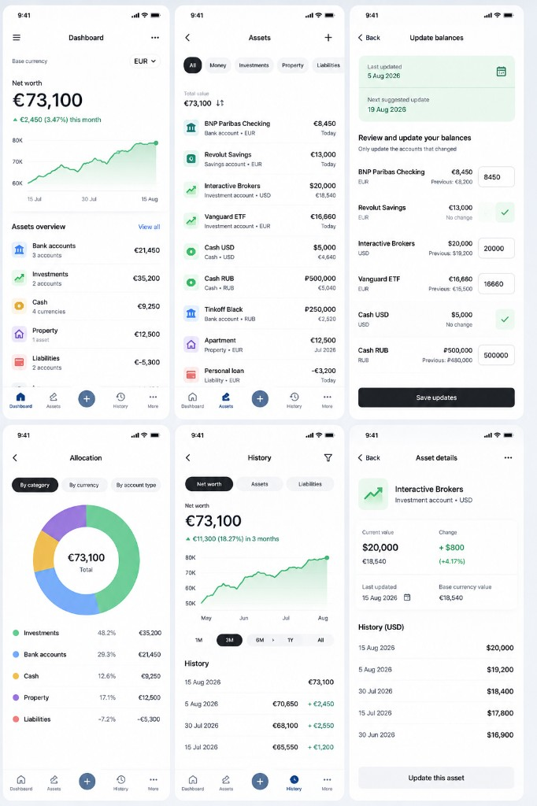

# Screen mocks

Starting UI mocks for My Money. These are a design sketch, not a contract — layout, copy, and navigation can change during implementation.

Intended screens (from the initial mock):

1. **Dashboard** — net worth, monthly change, trend chart, category totals, bottom nav.
2. **Assets** — filter chips, per-account list with native + base currency values.
3. **Update balances** — bulk update with previous value, no-change confirm, save.
4. **Allocation** — donut by category / currency / account type.
5. **History** — range chips, net-worth chart, snapshot list.
6. **Asset details** — one asset’s value, change, and native-currency history.

Bottom navigation in the mock: Dashboard, Assets, center “+” (quick update), History, More.
